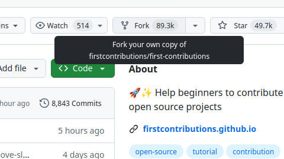
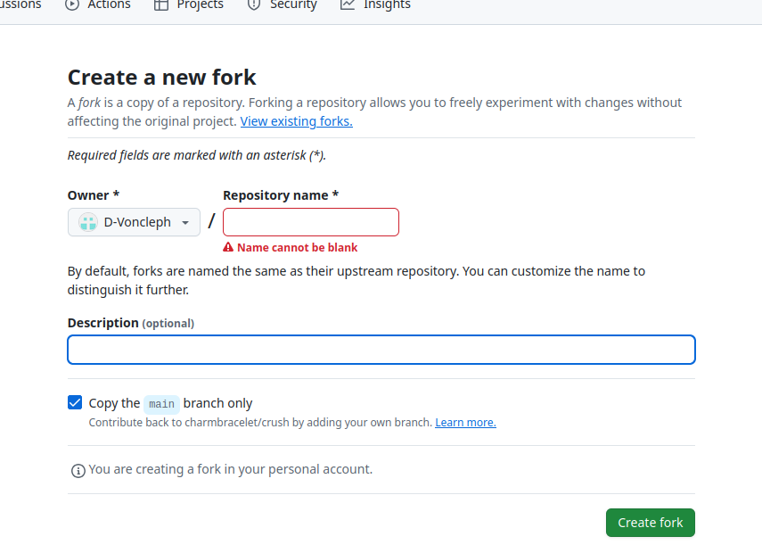

# Contributing to MyFinanceTracker

We welcome contributions to the `MyFinanceTracker` project! To ensure a smooth process for everyone, please follow these guidelines.

## Our Contribution Workflow

We use the standard Fork and Pull Request workflow for all contributions..dkdbbdksbd

### 1. Fork the Repository

Start by forking the `MyFinanceTracker` repository on GitHub to create your own copy.

  

### 2. Clone Your Fork

Next, clone your forked repository to your local machine to begin making changes.

```bash
git clone [https://github.com/your-username/MyFinanceTracker.git](https://github.com/your-username/MyFinanceTracker.git)